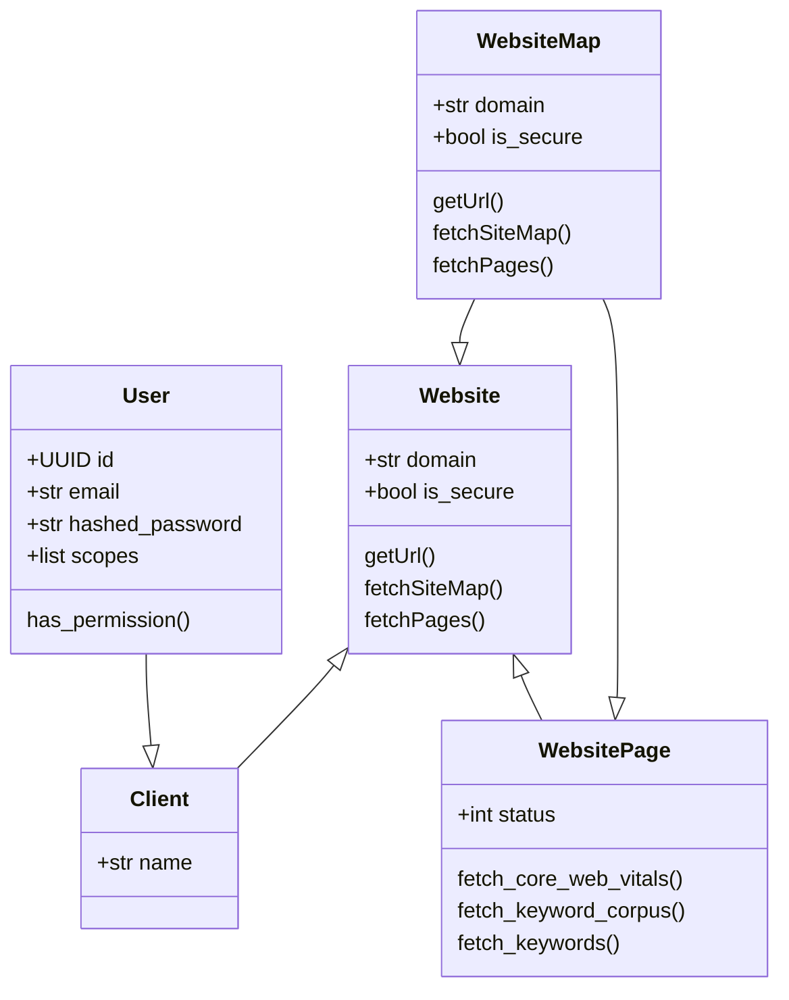

# GCAPI Backend

  

## Table of Contents

- [GCAPI Backend](#gcapi-backend)
  - [Table of Contents](#table-of-contents)
  - [Getting Started](#getting-started)
- [Backend Tool Chest](#backend-tool-chest)
  - [Alembic](#alembic)
    - [Configuration](#configuration)
    - [Commands](#commands)
    - [Resources](#resources)
  - [SQLAlchemy ORM](#sqlalchemy-orm)
    - [Resources](#resources-1)
  - [PyTest](#pytest)
    - [Commands](#commands-1)
    - [Resources](#resources-2)
- [Backend Data Model](#backend-data-model)
  - [Model Architecture](#model-architecture)

---

## Getting Started

First check to ensure Python 3.10 is installed and is the current version in use.

    python3 --version
    > python3.10.5

Create a virtual environment, activate it, then install the backend python pip `requirements.dev.txt` file.

    python3.10 -m venv venv
    source venv/bin/activate
    python -m pip install --upgrade pip
    python -m pip install poetry
    poetry install
    uvicorn app.main:app --host 0.0.0.0 --port 8888 --log-level info --reload
    > ... App Running at 0.0.0.0:8888
    > :q
    source venv/bin/deactivate

  

# Backend Tool Chest

## Alembic

### Configuration

First, run the alembic init command and specify where the migrations are to be stored.

    alembic init app/db/migrations

Next edit the `alembic.ini` file to the location of the initialized alembic directory

    [alembic]
    script_location = app/db/migrations

Last, edit the `env.py` file in the migrations directory to include your config and db base to migrate.

### Commands

Check current db version.

    alembic current

After changing db models/tables, run revision, and autogenerate.
Always add a message about what changed in the db models/tables.

    alembic revision --autogenerate -m "added table ____"
    alembic upgrade head
    alembic upgrade +1
    alembic downgrade -1
    alembic downgrade base

### Resources

- [FastAPI, SQL, and Alembic](https://ahmed-nafies.medium.com/fastapi-with-sqlalchemy-postgresql-and-alembic-and-of-course-docker-f2b7411ee396)

---

## SQLAlchemy ORM

### Resources

- [SQLAlchemy Relationship Loading Techniques](https://docs.sqlalchemy.org/en/14/orm/loading_relationships.html)

---

## PyTest

### Commands

    pytest
    pytest app/tests/crud
    pytest app/tests/api/api_v1/test_websites.py

### Resources

- [FastAPI PyTest Coverage WalkThrough](https://www.azepug.az/posts/fastapi/ecommerce-fastapi-nuxtjs/ecommerce-pytest-user-auth-part1.html)
- [PyTest Raising Exceptions](https://docs.pytest.org/en/6.2.x/assert.html)

  

# Backend Data Model

## Model Architecture

