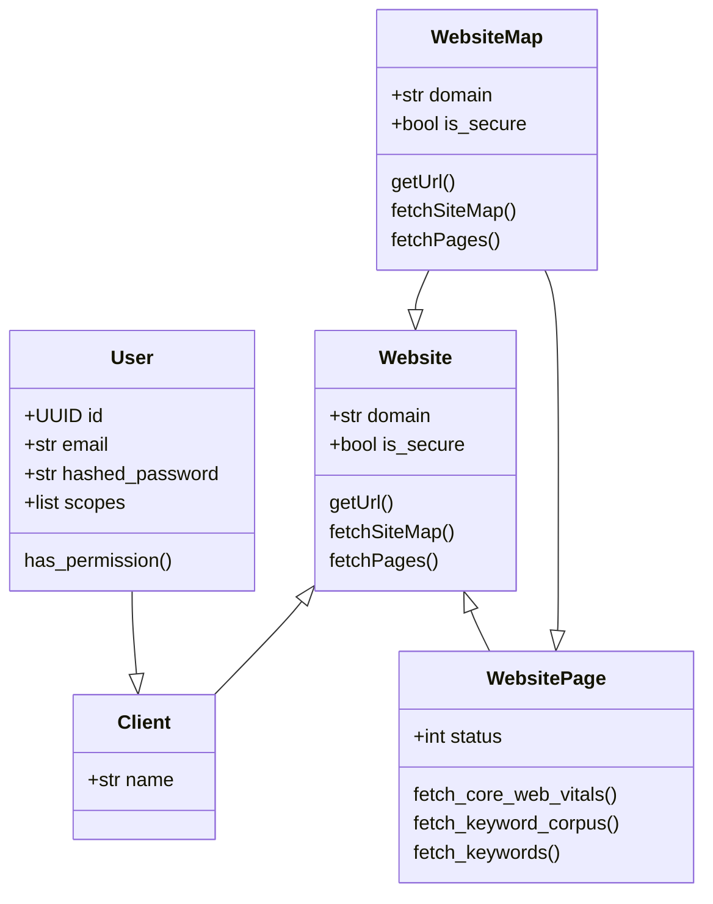

# GCAPI Backend

.. image:: https://github.com/joeygrable94/GCAPI-Backend/workflows/CI/badge.svg
   :target: https://github.com/joeygrable94/GCAPI-Backend/actions?query=CI
   :alt: GitHub Actions - CI

.. image:: https://github.com/joeygrable94/GCAPI-Backend/workflows/pre-commit/badge.svg
   :target: https://github.com/joeygrable94/GCAPI-Backend/actions?query=workflow%3Apre-commit
   :alt: GitHub Actions - pre-commit

.. image:: https://img.shields.io/codecov/c/gh/joeygrable94/GCAPI-Backend
   :target: https://app.codecov.io/gh/joeygrable94/GCAPI-Backend
   :alt: Codecov

## Table of Contents

- [GCAPI Backend](#gcapi-backend)
  - [Table of Contents](#table-of-contents)
  - [Getting Started](#getting-started)
  - [A Note on Upgrading Python Packages](#a-note-on-upgrading-python-packages)
- [Backend Tool Chest](#backend-tool-chest)
  - [Alembic](#alembic)
    - [Configuration](#configuration)
    - [Commands](#commands)
    - [Resources](#resources)
  - [SQLAlchemy ORM](#sqlalchemy-orm)
    - [Resources](#resources-1)
  - [PyTest](#pytest)
    - [Commands](#commands-1)
    - [Resources](#resources-2)
- [Backend Data Model](#backend-data-model)
  - [Model Architecture](#model-architecture)

---

## Getting Started

First check to ensure Python 3.10 is installed and is the current version in use.

    python3 --version
    > python3.10

Create a virtual environment, activate it, then install the backend python pip `requirements.dev.txt` file.

    python3.10 -m venv venv
    source venv/bin/activate
    python -m pip install -r requirements.dev.txt
    bash ./start.sh
    > ... App Running at 0.0.0.0:8888
    > :q
    source venv/bin/deactivate

## A Note on Upgrading Python Packages

WARNING: Be sure you install the `requirements.dev.txt` file in your development environment for everything to install and all tests to run correctly. ONLY use the alternate `requirements.txt` file to test the entire stack using the latest version of all python packages. THIS IS NOT RECOMMENDED.

If you want to upgrade specific packages:

1. make a new git branch
2. update the packages in the `requirements.dev.txt` file
3. install the updated package in the virtual environment
4. make api code changes so that the upgraded pip package passes all tests
5. commit changes to the branch
6. submit a pull request
7. upgraded pip package and api code changes will be reviewed
8. code changes will be merged into the main branch or rejected with reason

  

# Backend Tool Chest

## Alembic

### Configuration

First, run the alembic init command and specify where the migrations are to be stored.

    alembic init app/db/migrations

Next edit the `alembic.ini` file to the location of the initialized alembic directory

    [alembic]
    script_location = app/db/migrations

Last, edit the `env.py` file in the migrations directory to include your config and db base to migrate.

### Commands

Check current db version.

    alembic current

After changing db models/tables, run revision, and autogenerate.
Always add a message about what changed in the db models/tables.

    alembic revision --autogenerate -m "added table ____"
    alembic upgrade head
    alembic upgrade +1
    alembic downgrade -1
    alembic downgrade base

### Resources

- [FastAPI, SQL, and Alembic](https://ahmed-nafies.medium.com/fastapi-with-sqlalchemy-postgresql-and-alembic-and-of-course-docker-f2b7411ee396)

---

## SQLAlchemy ORM

### Resources

- [SQLAlchemy Relationship Loading Techniques](https://docs.sqlalchemy.org/en/14/orm/loading_relationships.html)

---

## PyTest

### Commands

    pytest --asyncio-mode=strict
    pytest app/tests/crud --asyncio-mode=strict
    pytest app/tests/api/api_v1/test_websites.py --asyncio-mode=strict

### Resources

- [FastAPI PyTest Coverage WalkThrough](https://www.azepug.az/posts/fastapi/ecommerce-fastapi-nuxtjs/ecommerce-pytest-user-auth-part1.html)
- [PyTest Raising Exceptions](https://docs.pytest.org/en/6.2.x/assert.html)

  

# Backend Data Model

## Model Architecture

```mermaid
classDiagram
    User --|> Client
    Website <|-- Client
    Website <|-- WebsitePage
    WebsiteMap --|> WebsitePage
    WebsiteMap --|> Website
    class User{
        +UUID id
        +str email
        +str hashed_password
        +list scopes
        has_permission()
    }
    class Client{
        +str name
    }
    class Website{
        +str domain
        +bool is_secure
        getUrl()
        fetchSiteMap()
        fetchPages()
    }
    class WebsiteMap{
        +str domain
        +bool is_secure
        getUrl()
        fetchSiteMap()
        fetchPages()
    }
    class WebsitePage{
        +int status
        fetch_core_web_vitals()
        fetch_keyword_corpus()
        fetch_keywords()
    }
```
