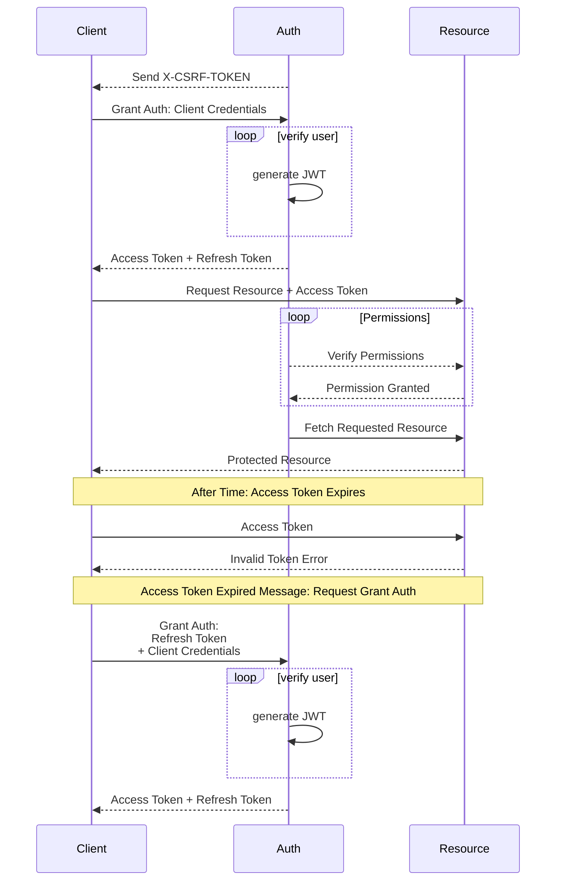

# GCAPI Security

## Table of Contents

- [GCAPI Security](#gcapi-security)
  - [Table of Contents](#table-of-contents)
  - [Supported Versions](#supported-versions)
  - [Reporting a Vulnerability](#reporting-a-vulnerability)
- [Security Policy](#security-policy)
  - [Getting Starting](#getting-starting)
  - [User Registration and Verification](#user-registration-and-verification)
  - [Identy Access Management (IAM): Authetication \& Authorization (Permissions)](#identy-access-management-iam-authetication--authorization-permissions)
    - [IAM: Identity Access Management](#iam-identity-access-management)
      - [Identity: Authentication Flow](#identity-authentication-flow)
      - [Access: Permissions Flow](#access-permissions-flow)
  - [Testing Tools](#testing-tools)
    - [GitLeaks](#gitleaks)
      - [References](#references)

## Supported Versions

| Version   | Supported          |
| --------- | ------------------ |
| < 1.0.0   | :x:                |

## Reporting a Vulnerability

This project is not open for vulnerability reports. We DO NOT recommend using this in production—it is only a test development project. We will not fix vulnerabilities until this project get's pushed into production.

  

# Security Policy

## Getting Starting

Generate App Secrets

    > openssl rand -hex 32
    > bac96a186df9d4c9d91cd5f07ada34bab56e4cd55ba04b51d593bbdcff0a5077

  

## User Registration and Verification

Users must register with a valid email address and password before they are able to login. After registering the new user will be emailed an email verification link. The new user must click the link in the email and confirm their email address, and then the user verified user will be redirected to the login page.

  

## Identy Access Management (IAM): Authetication & Authorization (Permissions)

Users are able to ONLY able to access resources on the API by first authenticating their access, and then the user must be granted the correct Authorization / Permission in order to access the resource.

- **Users** are able to login through a browser **Client** to request and access various resources on the **API**.
- The **Client** is a web or mobile browser based interface by which the **User** interacts with the **API**.
- **Authentication** is the primary process of verifying the existance and identity of an individual user.
- **Authorization** (**Permissions**) is a secondary process of confirming whether or not an authenticated user is capabile of accessing the resource in the request.
- **User Permissions** are stored in the user table in the scopes column of the databse.

  

### IAM: Identity Access Management

#### Identity: Authentication Flow

Before any protected resource on the API is accessed, Users must supply their auth credentials `username` and `password` with an optional `scope` parameter for the specific resource being requested. The API's `user_manager` handle's all user identity authentication.
- If a user fails to correctly identify themself or they attempt to access a resource which they do not have permission to access, the API will deny the request and return an unauthorzed error message.
- Alternatively, if the supplied credentials are valid and verified, the API will return a successfully authorzed response with the respective user's `access_token` and a `refresh_token`.

#### Access: Permissions Flow

<!--
Upon success authorization the `user_manager` generates a [JSON Web Token JWT](https://datatracker.ietf.org/doc/html/rfc7519)... more coming soon.

  

## Testing Tools

### GitLeaks

    gitleaks detect --verbose --config=./gitleaks.toml

#### References

- [GitLeaks Repository](https://github.com/zricethezav/gitleaks)
- [GitLeaks Allow List for Inline Cases of False Positive Secrets Leak](https://github.com/zricethezav/gitleaks/issues/579)
- [GitLeaks Custom Config .toml File](https://github.com/zricethezav/gitleaks/issues/787)

---
