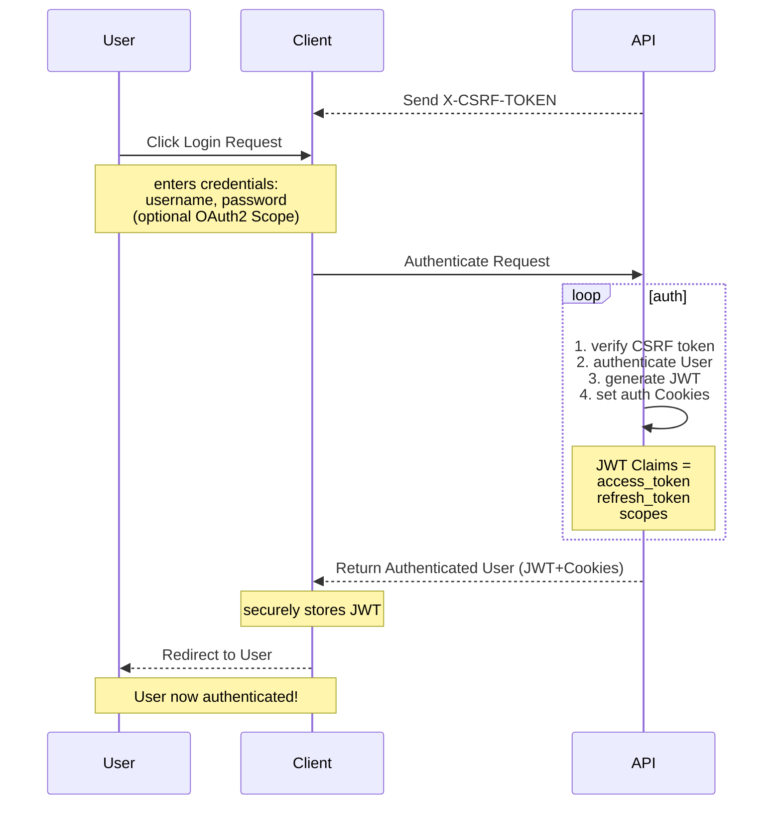
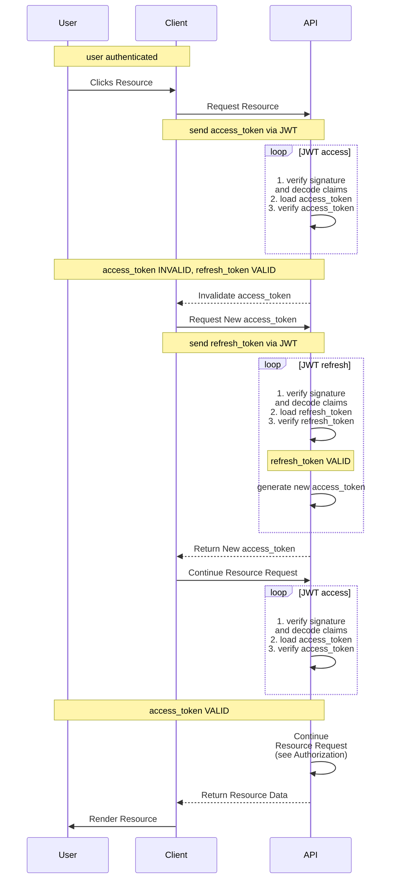
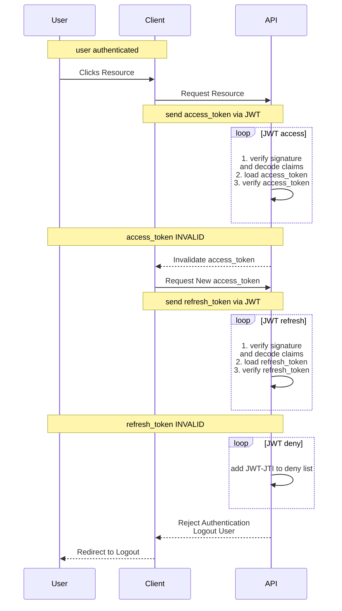
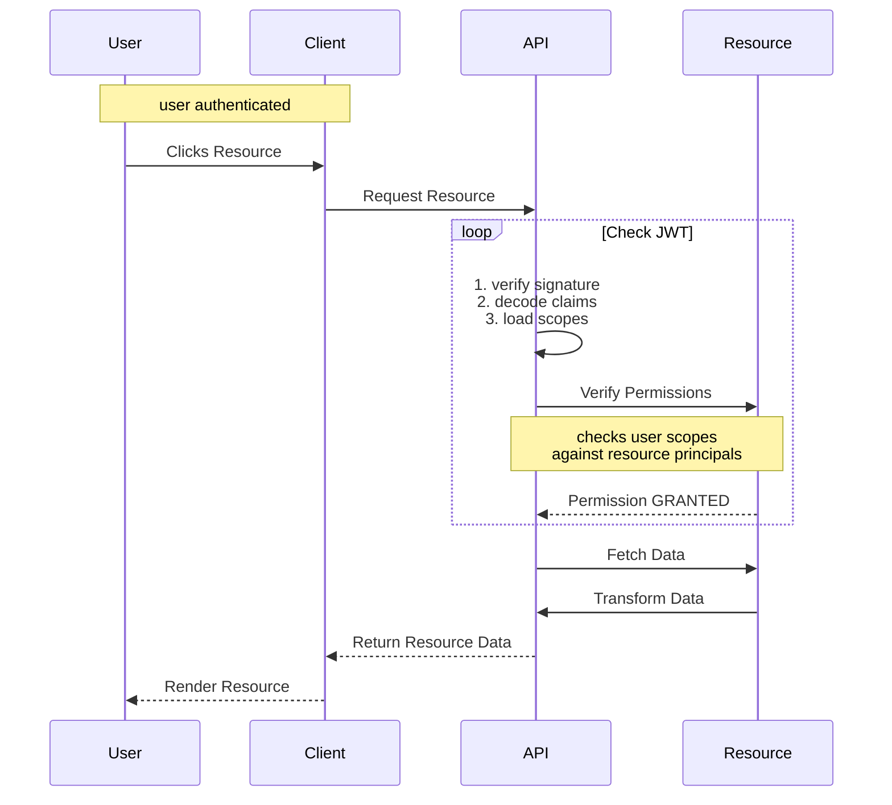
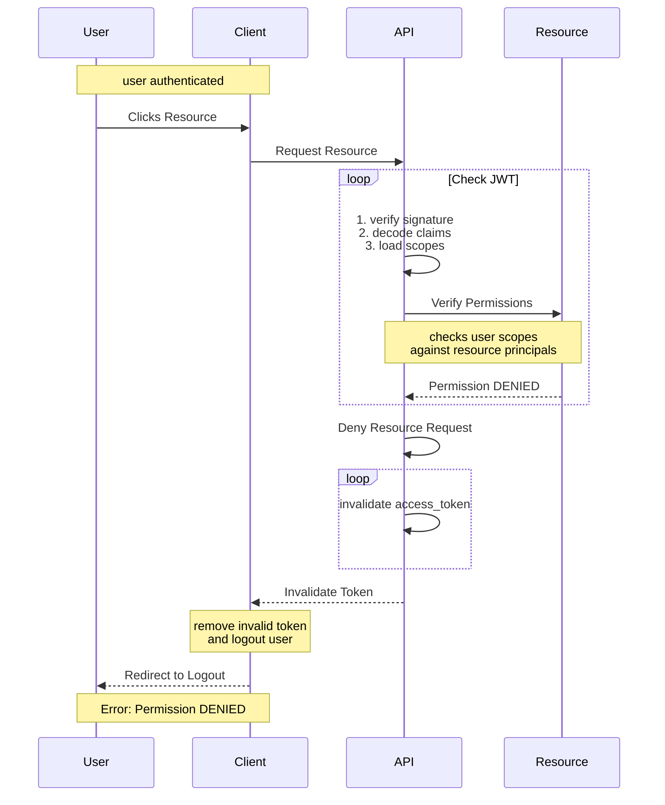

# GCAPI Security

## Table of Contents

- [GCAPI Security](#gcapi-security)
  - [Table of Contents](#table-of-contents)
  - [Supported Versions](#supported-versions)
  - [Reporting a Vulnerability](#reporting-a-vulnerability)
- [Security Policy](#security-policy)
  - [Getting Starting](#getting-starting)
  - [Identy Access Management (IAM): Authetication & Authorization (Permissions)](#identy-access-management-iam-authetication--authorization-permissions)
    - [Authetication (Identity Verification)](#authetication-identity-verification)
      - [Authentication Request Access Token Flow :white_check_mark:](#authentication-request-access-token-flow-white_check_mark)
      - [Authentication Refresh Access Token Flow :white_check_mark:](#authentication-refresh-access-token-flow-white_check_mark)
      - [Authentication Refresh Token Rejected :x:](#authentication-refresh-token-rejected-x)
    - [Authorization (Resource Permissions)](#authorization-resource-permissions)
      - [Resource Request — Permission GRANTED :white_check_mark:](#resource-request--permission-granted-white_check_mark)
      - [Resource Request — Permission DENIED :x:](#resource-request--permission-denied-x)
  - [Testing Tools](#testing-tools)
    - [GitLeaks](#gitleaks)
      - [References](#references)

## Supported Versions

| Version   | Supported          |
| --------- | ------------------ |
| < 1.0.0   | :x:                |

## Reporting a Vulnerability

This project is not open for vulnerability reports. We DO NOT recommend using this in production—it is only a test development project. We will not fix vulnerabilities until this project get's pushed into production.

  

# Security Policy

## Getting Starting

Generate App Secrets

    > openssl rand -hex 32
    > bac96a186df9d4c9d91cd5f07ada34bab56e4cd55ba04b51d593bbdcff0a5077

  

## Identy Access Management (IAM): Authetication & Authorization (Permissions)

Users are able to ONLY able to access resources on the API by first authenticating their access, and then the user must be granted the correct Authorization / Permission in order to access the resource.

- **Users** are able to login through a browser **Client** to request and access various resources on the **API**.
- The **Client** is a web or mobile browser based interface by which the **User** interacts with the **API**.
- **Authentication** is the primary process of verifying the existance and identity of an individual user.
- **Authorization** (**Permissions**) is a secondary process of confirming whether or not an authenticated user is capabile of accessing the resource in the request.
- **User Permissions** are stored in the user table in the scopes column of the databse.

  

### Authetication (Identity Verification)

#### Authentication Request Access Token Flow :white_check_mark:

```mermaid
sequenceDiagram
    participant User
    participant Client
    API-->>Client: Send X-CSRF-TOKEN
    User->>Client: Click Login Request
    Note over User,Client: enters credentials:<br/>username, password<br/>(optional OAuth2 Scope)
    Client->>API: Authenticate Request
    loop auth
        API->>API: 1. verify CSRF token<br/>2. authenticate User<br/>3. generate JWT<br/>4. set auth Cookies
        Note over API: JWT Claims = <br/>access_token<br/>refresh_token<br/>scopes
    end
    API-->>Client: Return Authenticated User (JWT+Cookies)
    Note over Client: securely stores JWT
    Client-->>User: Redirect to User
    Note over User,Client: User now authenticated!
```

  

#### Authentication Refresh Access Token Flow :white_check_mark:

```mermaid
sequenceDiagram
    participant User
    participant Client
    Note over User,Client: user authenticated
    User->>Client: Clicks Resource
    Client->>API: Request Resource
    Note over Client,API: send access_token via JWT
    loop JWT access
        API->>API: 1. verify signature <br/> and decode claims<br/>2. load access_token<br/>3. verify access_token
    end
    Note over User,API: access_token INVALID, refresh_token VALID
    API-->>Client: Invalidate access_token
    Client->>API: Request New access_token
    Note over Client,API: send refresh_token via JWT
    loop JWT refresh
        API->>API: 1. verify signature <br/>and decode claims<br/>2. load refresh_token<br/>3. verify refresh_token
        Note over API: refresh_token VALID
        API->>API: generate new access_token
    end
    API-->>Client: Return New access_token
    Client->>API: Continue Resource Request
    loop JWT access
        API->>API: 1. verify signature <br/> and decode claims<br/>2. load access_token<br/>3. verify access_token
    end
    Note over User,API: access_token VALID
    API->>API: Continue<br/>Resource Request<br/>(see Authorization)
    API-->>Client: Return Resource Data
    Client->>User: Render Resource
```

  

#### Authentication Refresh Token Rejected :x:

```mermaid
sequenceDiagram
    participant User
    participant Client
    Note over User,Client: user authenticated
    User->>Client: Clicks Resource
    Client->>API: Request Resource
    Note over Client,API: send access_token via JWT
    loop JWT access
        API->>API: 1. verify signature<br/> and decode claims<br/>2. load access_token<br/>3. verify access_token
    end
    Note over User,API: access_token INVALID
    API-->>Client: Invalidate access_token
    Client->>API: Request New access_token
    Note over Client,API: send refresh_token via JWT
    loop JWT refresh
        API->>API: 1. verify signature <br/>and decode claims<br/>2. load refresh_token<br/>3. verify refresh_token
    end
    Note over User,API: refresh_token INVALID
    loop JWT deny
        API->>API: add JWT-JTI to deny list
    end
    API-->>Client: Reject Authentication<br/>Logout User
    Client-->>User: Redirect to Logout
```

  

### Authorization (Resource Permissions)

#### Resource Request — Permission GRANTED :white_check_mark:

```mermaid
sequenceDiagram
    participant User
    participant Client
    Note over User,Client: user authenticated
    User->>Client: Clicks Resource
    Client->>API: Request Resource
    loop Check JWT
        API->>API: 1. verify signature <br/>2. decode claims<br/>3. load scopes
        API->>Resource: Verify Permissions
        Note over API,Resource: checks user scopes<br/>against resource principals
        Resource-->>API: Permission GRANTED
    end
    API->>Resource: Fetch Data
    Resource->>API: Transform Data
    API-->>Client: Return Resource Data
    Client-->>User: Render Resource
```

  

#### Resource Request — Permission DENIED :x:

```mermaid
sequenceDiagram
    participant User
    participant Client
    Note over User,Client: user authenticated
    User->>Client: Clicks Resource
    Client->>API: Request Resource
    loop Check JWT
        API->>API: 1. verify signature <br/>2. decode claims<br/>3. load scopes
        API->>Resource: Verify Permissions
        Note over API,Resource: checks user scopes<br/>against resource principals
        Resource-->>API: Permission DENIED
    end
    API->>API: Deny Resource Request
    loop
        API->>API: invalidate access_token
    end
    API-->>Client: Invalidate Token
    Note over Client: remove invalid token<br/>and logout user
    Client-->>User: Redirect to Logout
    Note over User,Client: Error: Permission DENIED
```

  

## Testing Tools

### GitLeaks

    gitleaks detect --verbose --config=./gitleaks.toml

#### References

- [GitLeaks Repository](https://github.com/zricethezav/gitleaks)
- [GitLeaks Allow List for Inline Cases of False Positive Secrets Leak](https://github.com/zricethezav/gitleaks/issues/579)
- [GitLeaks Custom Config .toml File](https://github.com/zricethezav/gitleaks/issues/787)

---
